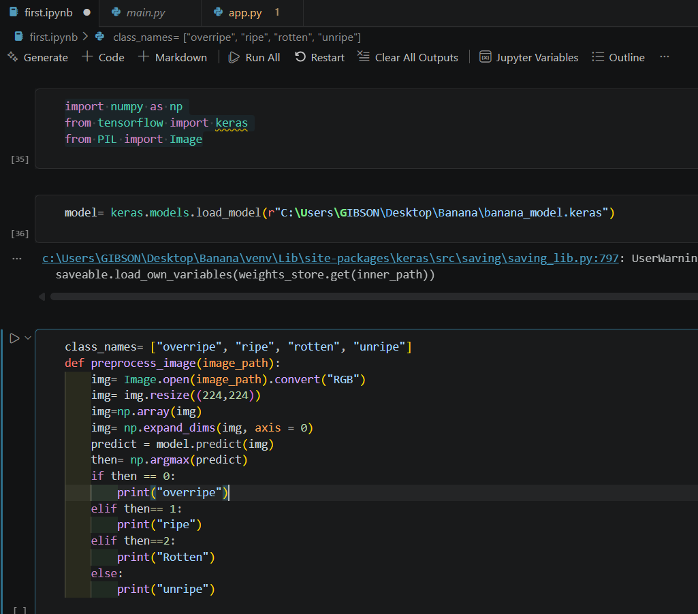
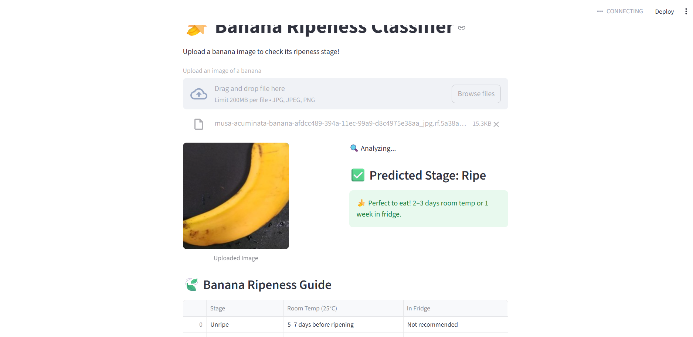
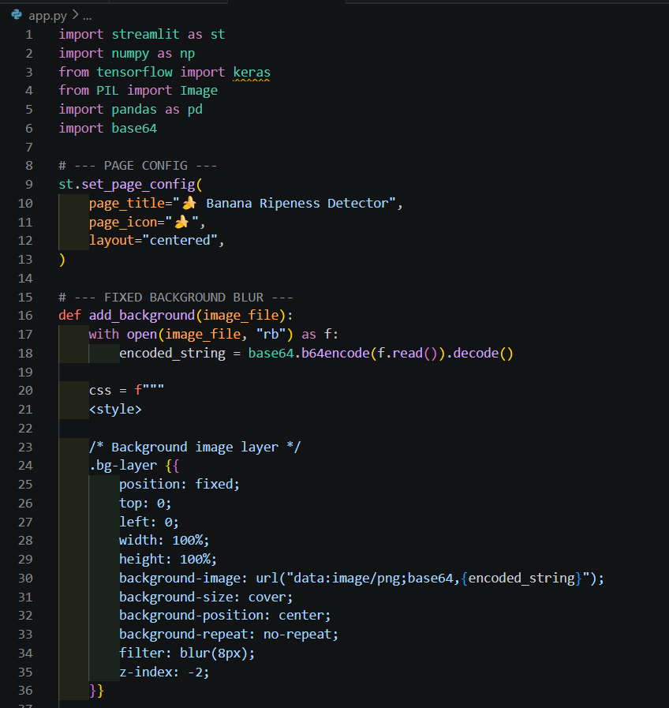

# 🍌 Banana Ripeness Detection using CNN

## 📌 Overview

This project is a deep learning-based image classification system designed to identify banana ripeness stages and estimate fruit freshness. Users can upload a banana image through a Streamlit web application, and the model predicts whether the banana is:

* Unripe
* Ripe
* Overripe
* Rotten

The system also estimates the approximate storage duration under:

* Room temperature
* Refrigerated conditions

The main objective of this project is to solve a real-world fruit quality assessment problem using Convolutional Neural Networks (CNNs).

---

# 📂 Dataset

* Source: Kaggle
* Total Images: 13,478
* Classes:

  * Unripe
  * Ripe
  * Overripe
  * Rotten

> Due to dataset size limitations, the dataset is not included in this repository.

---

# 🛠 Technologies Used

* Python
* TensorFlow / Keras
* CNN (Convolutional Neural Network)
* Streamlit
* Google Colab
* NumPy
* Matplotlib

---

# 🧠 Model Architecture

## Preprocessing

* Image Rescaling / Normalization
* Input Shape: 224 × 224 × 3

## CNN Layers

* Conv2D + MaxPooling2D + Dropout layers
* GlobalPooling2D layer
* Dense(32, ReLU)
* Dense(4, Softmax)

## Training Configuration

* Optimizer: Adam
* Loss Function: Sparse Categorical Crossentropy
* Training Epochs: 20

---

# 📊 Results

* Training Accuracy: 92.66%
* Validation Accuracy: 93.77%

---

# ⚡ Challenges Faced

One of the major challenges during this project was training a large image dataset efficiently. Since this was my first large-scale image classification project, I used the Google Colab T4 GPU to accelerate training performance.

Initially, the model produced lower accuracy due to inconsistent image preprocessing. After implementing proper image rescaling and normalization techniques, the model achieved significantly better accuracy and training stability.

This project helped me gain practical experience in:

* CNN architecture design
* Image preprocessing
* Model optimization
* GPU-based training
* Deployment using Streamlit

---

# 🚀 Deployment

The model was deployed as an interactive Streamlit web application where users can upload banana images and receive instant predictions.

---

# 🔮 Future Improvements

* Improve shelf-life prediction accuracy
* Expand dataset diversity
* Add support for multiple fruit types
* Optimize model for mobile deployment

---
# 📸 Application Preview

## Model_loading



## Prediction Output



## Streamlit




---

# ▶️ Run Locally

```bash
git clone https://github.com/gibsongeorge/banana-ripeness-detection.git

cd banana-ripeness-detection

pip install -r requirements.txt

streamlit run app.py
```

---

# 👨‍💻 Author

Gibson George
